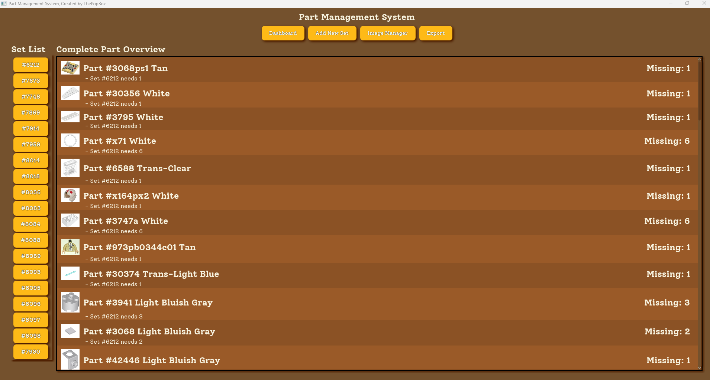
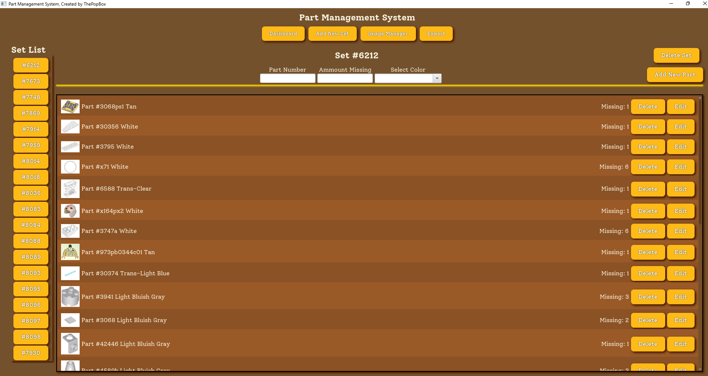
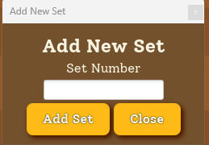
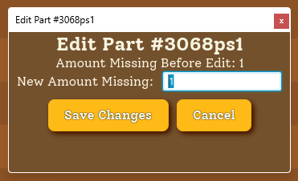
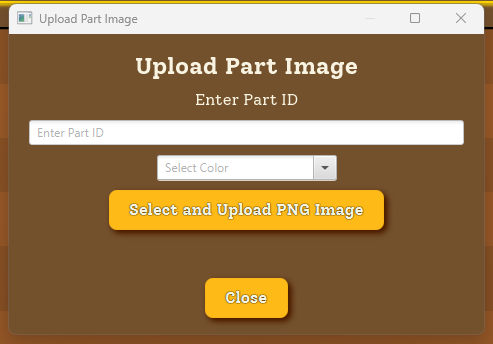

# Lego Part Manager
Lego part manager application with Bricklink import compatibility, built using JavaFX for Windows
 A modular JavaFX desktop application for organizing Lego parts, colors, and sets with persistent local file storage. 

## Table of Contents
- [Lego Part Manager](#lego-part-manager)
- [Overview](#overview)
- [Screenshots](#screenshots)
- [Installation](#installation)
- [Architecture](#architecture)
  - [Model Layer](#model-layer)
  - [Service Layer](#service-layer)
  - [Data Layer](#data-layer)
  - [Application Layer](#application-layer)
- [Data Persistence](#data-persistence)
- [Technology Stack](#technology-stack)
- [Technical Concepts](#technical-concepts)
- [Challenges Solved](#challenges-solved)
- [Skills Demonstrated](#skills-demonstrated)

# Overview
This application provides the user with:
<ul>
  <li>GUI-based inventory management</li>
  <li>Part and color association</li>
  <li>Set organization</li>
  <li>Persistent local file storage</li>
  <li>Importable list of missing parts for Bricklink</li>
  <li>Modular Java structure (Module-info.java)</li>
</ul>

# Screenshots
<b>Main Application Dashboard Screenshot</b>

This screenshot shows the main dashboard, along with which sets require what part. If multiple sets require the same piece, the part list will tell you. 

  
<b>Click To Show More Screenshots</b>

 <b>Set Inventory Page Screenshot</b> 
  

 <b>Add New Set Screenshot</b> 

 <b>Edit Part Screenshot</b> 

 <b>Part Image Import Screenshot</b> 

# Installation
<b>Option One - Download Executable (Windows)</b>
<ol>
  <li>Ensure Java 17 is installed on your machine (This is not mandatory for everyone)</li>
  <li>Visit the repo releases, download the newest exe</li>
  <li>Run the exe</li>
  <li>Launch the application</li>
</ol>
<b>Option Two - Build From Source</b>
 <b>Requirements</b>
<ul>
  <li>Java 17</li>
  <li>Maven</li>
</ul>
<b>Installation Steps</b>
<ol>
  <li>git clone https://github.com/thepopbox/lego-part-manager.git</li>
  <li>cd lego-part-manager</li>
  <li>mvn clean install</li>
  <li>Run the application using your IDE or JavaFX runtime</li>
</ol>

# Architecture
This Lego part management application follows a layered design structure:

## Model Layer
These classes encapsulate object state and enfore domain relationships
<ul>
  <li>LegoPart</li>
  <li>LegoCompletePart</li>
  <li>LegoSet</li>
  <li>LegoColor</li>
</ul>

## Service Layer
This class is responsible for managing color data and providing business logic abstraction between UI and data models
<ul>
  <li>ColorManager</li>
</ul>

## Data Layer
This class is responsible for handling structured data access and persistence
<ul>
  <li>LegoColorData</li>
</ul>

## Application Layer
These classes handle application startup and runtime execution
<ul>
  <li>Launcher</li>
  <li>LegoTester</li>
</ul>

# Data Persistence
This Lego part management application automatically generates a data directory within the user's machine (C Drive) to store application data
 Reasons for this are:
<ul>
  <li>File I/O handling</li>
  <li>Local directory management</li>
  <li>Persistent object state storage</li>
  <li>Structured application configuration management</li>
</ul>

# Technology Stack
<ul>
  <li>Java</li>
  <li>JavaFX</li>
  <li>Maven</li>
  <li>Modular Java (module-info.java)</li>
  <li>File-base persistence</li>
</ul>

# Technical Concepts 
<ul>
  <li>Object-Oriented Design</li>
  <li>Encapsulation & Composition</li>
  <li>Separation of Concerns</li>
  <li>Layered Architecture</li>
  <li>Modular java Development</li>
  <li>JavaFX GUI Architecture</li>
  <li>File Persistence & Directory Management</li>
  <li>Structured Application Packaging</li>
</ul>

# Challenges Solved
<b>Local Data Persistence</b>
 Implemented directory creation and structure file storage
 <b>Modular Java Configuration</b>
 Configured module dependencies to maintain modern Java standards
 <b>Separation Between UI & Data</b>
 Avoided business logic directly inside GUI classes by introducing structured model and manager classes

# Skills Demonstrated
<ul>
  <li>JavaFX GUI development</li>
  <li>Modular java project management</li>
  <li>Maven project management</li>
  <li>Desktop application packaging</li>
  <li>OOP architecture</li>
  <li>File system interaction</li>
  <li>Practical application deployment</li>
</ul>
